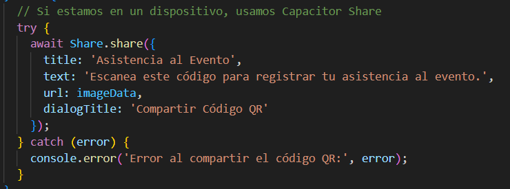
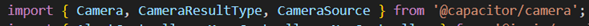
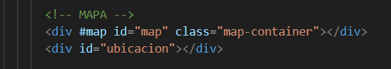

# CHECKAPP: Gestión de Eventos y Asistencias
Una aplicación desarrollada con Ionic y Angular para gestionar eventos, registrar asistencias y ofrecer una experiencia fluida tanto para administradores como para participantes.

## Características Principales
•	Gestión de Eventos: Crear, editar y eliminar eventos de manera intuitiva.
•	Registro de Asistencia: Manual o mediante escaneo de códigos QR.
•	Generación de Códigos QR: Cada evento genera un QR único para registro rápido.
•	Compatibilidad Multidispositivo: Optimizado para dispositivos móviles y uso en navegadores.


### Requisitos Previos
Asegúrate de tener instalados los siguientes elementos en tu sistema:
•	Node.js (versión recomendada: LTS)
•	Angular CLI (versión compatible con el proyecto)
•	Ionic CLI (para compilar y ejecutar la aplicación)


### Instalación y Configuración
1. Clonar el Repositorio
Clona este repositorio en tu máquina local:

git clone agregar url del repositorio
cd e ingresar a la carpeta del proyecto

2. Instalar Dependencias
Ejecuta el siguiente comando para instalar las dependencias del proyecto:
npm install

## MANEJO DE ESTADOS

Se utilizó el hook ionViewWillEnter en login.page.ts para que se actualice la lista de usuarios registrados en la app antes de entrar al login.


## PLUGGINS UTILIZADOS

@capacitor-community/barcode-scanner: Escaneo de códigos QR para registrar asistencia.
Utilizado en scanner.service.ts para luego ser usado en home-participante y poder scannear el código qr del evento y así registrar la asistencia.


@capacitor/share: Compartir códigos QR a través de aplicaciones sociales o de mensajería. Utilizado en registro-asistencia-modal para compartir la imagen del código QR.



@capacitor/camera: Utilizado en perfil-usuario para subir una foto al perfil.



## REPOSITORIO COLABORATIVO EN GITHUB

https://github.com/Antena19/CheckApp.git

# PERSISTENCIA DE DATOS

Se utilizó LocalStorage en el proyecto para manejar la persistencia de datos de manera local en el dispositivo del usuario. Esto permite guardar y recuperar datos importantes de la aplicación, como información de usuario, detalles de eventos y registros de asistencia, incluso cuando la aplicación se reinicia o se cierra.

# USO DE GUARDS

Se utilizó AuthGuard y AdminGuard para controlar el acceso a ciertas rutas dentro de la aplicación basándose en condiciones específicas, relacionadas con la autenticación y autorización del usuario. 


# USO DE API

Se utilizó Google Maps API, herramienta desarrollada por Google que permite a los desarrolladores integrar funcionalidades de mapas y geolocalización en aplicaciones web y móviles.




# LANDING PAGE Y APK

Para ver la Landing Page, visita: [CheckApp Landing Page](https://antena19.github.io/PaginaWebCheckApp/)

Puedes descargar la app scaneando el codigo QR o precionado directamente en el boton "Descarga Aquí"

Utilizamos GitHub Pages debido a su integración directa con los repositorios de GitHub, lo que simplifica la actualización y el mantenimiento de la página web. Además, GitHub Pages ofrece hospedaje gratuito, lo que lo hace ideal para proyectos de código abierto y de pequeña escala como el nuestro.

# TESTING

se realizaron pruebas de testing utilizando herramientas como Jasmine + Karma.


# FIRMA DE LA APP

Para garantizar la seguridad y la integridad de nuestra aplicación, utilizamos una firma digital durante el proceso de construcción del APK. La firma verifica que la aplicación proviene del desarrollador auténtico y no ha sido alterada después de su compilación.

Utilizamos el siguiente comando para generar la clave de firma utilizando el keytool de Java:

```bash
keytool -genkey -v -keystore my-release-key.keystore -alias my-key-alias -keyalg RSA -keysize 2048 -validity 10000
```
El archivo se llama nombre_del_keystore.jks y esta en CheckApp\nombre_del_keystore.jks

# Autoras
ANGELINA MENDOZA Y PALOMA TAMAYO
Si tienes preguntas o necesitas soporte, no dudes en contactarnos.
